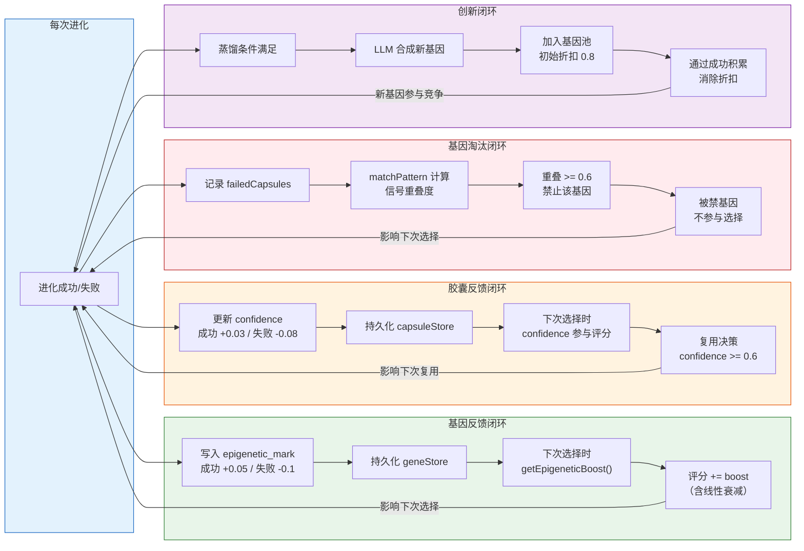
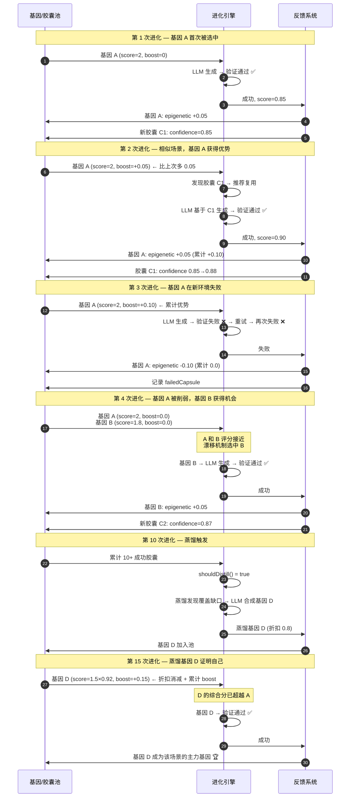

# 理想工作流程 — 全部问题修复后的进化循环

> 本文档描述所有 CODE_REVIEW_ISSUES.md 中的问题修复后，系统的完整工作流程。

## 核心进化循环

```mermaid
flowchart TD
    START([📥 API 请求<br/>POST /api/v1/evolve]) --> VALIDATE

    %% ========== 阶段一：输入校验 ==========
    subgraph PHASE1["阶段一：输入校验 (修复 1.1)"]
        VALIDATE[/"Zod Schema 校验<br/>LogEntrySchema.parse(logs)"/]
        VALIDATE -->|通过| EXTRACT
        VALIDATE -->|失败| REJECT_INPUT[/"❌ 返回 422<br/>附带具体校验错误"/]
    end

    %% ========== 阶段二：信号提取 ==========
    subgraph PHASE2["阶段二：信号提取 (修复 1.2-1.6)"]
        EXTRACT["提取结构化信号<br/>WeightedSignal[]"]
        EXTRACT --> EXTRACT_ERR["错误码/堆栈<br/>confidence: 0.95"]
        EXTRACT --> EXTRACT_PERF["性能指标<br/>可配置阈值"]
        EXTRACT --> EXTRACT_USER["用户意图<br/>短语匹配 或 LLM 分类<br/>(修复 1.3, 仅 user_input 时)"]
        EXTRACT --> EXTRACT_HIST["历史模式<br/>pattern 分析"]
        EXTRACT_ERR & EXTRACT_PERF & EXTRACT_USER & EXTRACT_HIST --> DEDUP
        DEDUP["按前缀分组去重 (修复 1.4)<br/>每类最多 N 条"]
        DEDUP --> PRIORITIZE["按优先级排序<br/>P0 error > P1 perf > P2 user"]
        PRIORITIZE --> SIGNALS["WeightedSignal[]<br/>信号 + 置信度 + 来源"]
    end

    %% ========== 阶段三：基因选择 ==========
    subgraph PHASE3["阶段三：基因选择 (修复 2.1-2.8)"]
        SIGNALS --> BAN_CHECK
        BAN_CHECK["基因禁止检查 (修复 2.6)<br/>用 matchPattern 而非 Jaccard 精确匹配"]
        BAN_CHECK --> SCORE["多层匹配评分 (修复 2.1)"]
        SCORE --> SCORE_EXACT["精确匹配 ×1.0"]
        SCORE --> SCORE_PREFIX["前缀匹配 ×0.7"]
        SCORE --> SCORE_SUBSTR["子串匹配 ×0.3"]
        SCORE_EXACT & SCORE_PREFIX & SCORE_SUBSTR --> NORMALIZE
        NORMALIZE["归一化评分 (修复 2.2)<br/>÷ signals_match.length"]
        NORMALIZE --> EPI_BOOST["加入表观遗传加成 (修复 2.8)<br/>getEpigeneticBoost(gene, env)"]
        EPI_BOOST --> DISTILL_FACTOR["蒸馏基因折扣<br/>随成功次数递减 (修复 6.5)"]
        DISTILL_FACTOR --> DRIFT["遗传漂移 (修复 2.3)<br/>可注入 RNG，可复现"]
        DRIFT --> GENE_RESULT{有匹配<br/>基因?}
        GENE_RESULT -->|是| SELECTED_GENE["选中基因 + 备选列表"]
        GENE_RESULT -->|否| AUTO_GENE["自动创建基因<br/>buildAutoGene()"]
        AUTO_GENE --> SELECTED_GENE
    end

    %% ========== 阶段四：胶囊匹配 ==========
    subgraph PHASE4["阶段四：胶囊匹配 (修复 3.1-3.5)"]
        SELECTED_GENE --> CAP_FILTER["预过滤 (修复 3.2)<br/>排除 _deleted 和 failed"]
        CAP_FILTER --> CAP_ENV["环境兼容检查 (修复 3.3)<br/>与 shouldReuse 严格度一致"]
        CAP_ENV --> CAP_SCORE["多层匹配评分<br/>信号分 + 环境分 + confidence"]
        CAP_SCORE --> CAP_RESULT{有匹配<br/>胶囊?}
        CAP_RESULT -->|是| REUSE_CHECK["复用决策<br/>shouldReuseCapsule()"]
        CAP_RESULT -->|否| NO_CAPSULE["无可用胶囊"]
        REUSE_CHECK --> REUSE_YES["推荐复用<br/>shouldReuse: true"]
        REUSE_CHECK --> REUSE_NO["仅作参考<br/>shouldReuse: false"]
    end

    %% ========== 阶段五：LLM 生成 ==========
    subgraph PHASE5["阶段五：LLM 生成"]
        REUSE_YES & REUSE_NO & NO_CAPSULE --> BUILD_PROMPT
        BUILD_PROMPT["构建进化提示<br/>信号 + 基因策略 + 胶囊参考"]
        BUILD_PROMPT --> LLM_CALL["调用 LLM<br/>generateEvolution()"]
        LLM_CALL --> LLM_OUTPUT["LLM 输出<br/>changes[] + confidence"]
    end

    %% ========== 阶段六：安全校验 ==========
    subgraph PHASE6["阶段六：安全校验 (修复 4.1-4.7)"]
        LLM_OUTPUT --> PATH_SAFETY["checkPathSafety() (修复 4.2)<br/>路径遍历 + 禁止路径 + 敏感文件"]
        PATH_SAFETY -->|有违规| BLOCK_PATH["❌ 阻止危险路径"]
        PATH_SAFETY -->|安全| BLAST
        BLAST["影响范围估算 (修复 4.5)<br/>考虑文件重要性<br/>testOnly 降级, configOnly 升级"]
        BLAST --> APPROVAL{需要<br/>审批?}
        APPROVAL -->|是| PENDING["⏸️ 暂存待审批 (修复 4.4)<br/>ApprovalRequiredError<br/>不计入 failedCapsules"]
        APPROVAL -->|否| CMD_CHECK
        CMD_CHECK["命令白名单 (修复 4.1)<br/>禁止 node -e / npx 未知包"]
        CMD_CHECK --> EXEC_VALID["执行验证命令<br/>executeValidation()"]
    end

    %% ========== 阶段七：结果处理 ==========
    subgraph PHASE7["阶段七：结果处理 (修复 7.1-7.4)"]
        EXEC_VALID --> VALID_RESULT{验证<br/>通过?}
        VALID_RESULT -->|否| RETRY{重试次数<br/>< N?}
        RETRY -->|是| RETRY_PROMPT["将失败信息反馈给 LLM (修复 7.4)<br/>重新生成"]
        RETRY_PROMPT --> LLM_CALL
        RETRY -->|否| FAIL_EVENT
        VALID_RESULT -->|是| CALC_SCORE["计算真实评分 (修复 7.3)<br/>score = f(LLM_confidence,<br/>validationResult, blastRadius)"]
        CALC_SCORE --> RECORD_EVENT["记录成功事件"]
        FAIL_EVENT["记录失败事件"]
    end

    %% ========== 阶段八：反馈回路 ==========
    subgraph PHASE8["阶段八：反馈回路 ⭐核心修复"]
        RECORD_EVENT --> CREATE_CAPSULE["创建新胶囊<br/>confidence 基于实际评分"]
        CREATE_CAPSULE --> UPDATE_POOL["更新内存池 (修复 7.1)<br/>capsulePool.push(capsule)"]
        
        RECORD_EVENT --> EPI_WRITE["写入表观遗传标记<br/>applyEpigeneticMarks()<br/>先清理过期标记 (修复 5.4)"]
        EPI_WRITE --> EPI_PERSIST["持久化基因<br/>geneStore.upsert()"]

        RECORD_EVENT --> CAP_UPDATE{使用了<br/>已有胶囊?}
        CAP_UPDATE -->|是| UPDATE_CAP["更新胶囊置信度 (修复 3.5)<br/>成功: +0.03, 失败: -0.08<br/>capsuleStore.update()"]
        CAP_UPDATE -->|否| SKIP_CAP_UPDATE["跳过"]

        FAIL_EVENT --> EPI_FAIL["写入失败标记<br/>boost: -0.1"]
        EPI_FAIL --> EPI_PERSIST
        FAIL_EVENT --> BAN_RECORD["记录失败胶囊<br/>用于基因禁止计算"]
    end

    %% ========== 阶段九：自动蒸馏 ==========
    subgraph PHASE9["阶段九：自动蒸馏 (修复 6.1-6.7)"]
        UPDATE_POOL & SKIP_CAP_UPDATE & UPDATE_CAP --> DISTILL_CHECK
        DISTILL_CHECK{蒸馏条件<br/>满足?}
        DISTILL_CHECK -->|否| RETURN_RESULT
        DISTILL_CHECK -->|是| DISTILL_PREPARE["收集数据 + 分析模式<br/>滑动窗口漂移检测 (修复 6.2)<br/>一致性覆盖检查 (修复 6.3)"]
        DISTILL_PREPARE --> DISTILL_LLM["LLM 合成新基因"]
        DISTILL_LLM --> DISTILL_VALIDATE["严格验证 (修复 6.4)<br/>检查 signals_match 非空<br/>检查 category 合法<br/>检查 strategy 非空"]
        DISTILL_VALIDATE -->|通过| DISTILL_SAVE["保存蒸馏基因<br/>初始折扣 0.8<br/>可通过成功积累消除"]
        DISTILL_VALIDATE -->|失败| DISTILL_DISCARD["丢弃无效基因"]
        DISTILL_SAVE --> RETURN_RESULT
        DISTILL_DISCARD --> RETURN_RESULT
    end

    RETURN_RESULT([📤 返回进化结果<br/>event + changes + capsule_id])

    %% ========== 样式 ==========
    classDef phase1 fill:#e3f2fd,stroke:#1565c0
    classDef phase2 fill:#f3e5f5,stroke:#7b1fa2
    classDef phase3 fill:#e8f5e9,stroke:#2e7d32
    classDef phase4 fill:#fff3e0,stroke:#e65100
    classDef phase5 fill:#fce4ec,stroke:#c62828
    classDef phase6 fill:#ffebee,stroke:#b71c1c
    classDef phase7 fill:#e0f2f1,stroke:#00695c
    classDef phase8 fill:#fff9c4,stroke:#f57f17
    classDef phase9 fill:#f1f8e9,stroke:#558b2f
    classDef error fill:#ffcdd2,stroke:#c62828

    class VALIDATE,REJECT_INPUT phase1
    class EXTRACT,EXTRACT_ERR,EXTRACT_PERF,EXTRACT_USER,EXTRACT_HIST,DEDUP,PRIORITIZE,SIGNALS phase2
    class BAN_CHECK,SCORE,SCORE_EXACT,SCORE_PREFIX,SCORE_SUBSTR,NORMALIZE,EPI_BOOST,DISTILL_FACTOR,DRIFT,GENE_RESULT,SELECTED_GENE,AUTO_GENE phase3
    class CAP_FILTER,CAP_ENV,CAP_SCORE,CAP_RESULT,REUSE_CHECK,REUSE_YES,REUSE_NO,NO_CAPSULE phase4
    class BUILD_PROMPT,LLM_CALL,LLM_OUTPUT phase5
    class PATH_SAFETY,BLOCK_PATH,BLAST,APPROVAL,PENDING,CMD_CHECK,EXEC_VALID phase6
    class VALID_RESULT,RETRY,RETRY_PROMPT,CALC_SCORE,RECORD_EVENT,FAIL_EVENT phase7
    class CREATE_CAPSULE,UPDATE_POOL,EPI_WRITE,EPI_PERSIST,CAP_UPDATE,UPDATE_CAP,SKIP_CAP_UPDATE,EPI_FAIL,BAN_RECORD phase8
    class DISTILL_CHECK,DISTILL_PREPARE,DISTILL_LLM,DISTILL_VALIDATE,DISTILL_SAVE,DISTILL_DISCARD phase9
```

## 反馈闭环示意

## 时序图：一次完整进化的模块交互

```mermaid
sequenceDiagram
    autonumber
    actor Agent as 外部 Agent
    participant API as Server API
    participant Engine as EvolutionEngine
    participant SigEx as SignalExtractor
    participant GeneSel as GeneSelector
    participant Epi as Epigenetic
    participant CapMgr as CapsuleManager
    participant LLM as LLM Provider
    participant ValGate as ValidationGate
    participant Distiller as SkillDistiller
    participant GeneDB as GeneStore
    participant CapDB as CapsuleStore

    Agent->>API: POST /api/v1/evolve { logs }

    %% ===== 阶段一：输入校验 =====
    rect rgb(227, 242, 253)
        Note over API: 阶段一：输入校验
        API->>API: Zod LogEntrySchema.parse(logs)
        alt 校验失败
            API-->>Agent: 422 { errors: [...] }
        end
        API->>Engine: evolve(validatedLogs)
    end

    %% ===== 阶段二：信号提取 =====
    rect rgb(243, 229, 245)
        Note over Engine,SigEx: 阶段二：信号提取
        Engine->>SigEx: extractSignals({ logs })
        SigEx->>SigEx: extractErrorSignals() → WeightedSignal[]
        SigEx->>SigEx: extractPerformanceSignals() → WeightedSignal[]
        opt 日志中包含 user_input 类型条目
            alt 方案 A：纯规则
                SigEx->>SigEx: 短语级关键词匹配
            else 方案 B：LLM 辅助 (可选)
                SigEx->>LLM: extractUserSignalsWithLLM(input)
                LLM-->>SigEx: 意图分类结果
            end
        end
        SigEx->>SigEx: extractHistoryPatterns()
        SigEx->>SigEx: deduplicateByPrefix(signals, maxPerPrefix=3)
        SigEx->>SigEx: prioritizeSignals(signals)
        SigEx-->>Engine: WeightedSignal[] (信号+置信度+来源)
    end

    %% ===== 阶段三：基因选择 =====
    rect rgb(232, 245, 233)
        Note over Engine,Epi: 阶段三：基因选择
        Engine->>GeneSel: banGenesFromFailedCapsules(failed, genePool)
        GeneSel->>GeneSel: matchPattern 计算重叠度 (非 Jaccard 精确匹配)
        GeneSel-->>Engine: bannedGeneIds[]
        Engine->>GeneSel: selectGene(genePool, signals, opts)
        
        loop 对每个未被禁基因
            GeneSel->>GeneSel: 多层匹配评分<br/>精确 ×1.0 / 前缀 ×0.7 / 子串 ×0.3
            GeneSel->>GeneSel: 归一化 ÷ signals_match.length
            GeneSel->>Epi: getEpigeneticBoost(gene, env)
            Epi-->>GeneSel: boost (−0.5 ~ +0.5，含衰减)
            GeneSel->>GeneSel: score += boost
            GeneSel->>GeneSel: 蒸馏基因折扣 (随成功次数递减)
        end
        
        GeneSel->>GeneSel: 遗传漂移 (可注入 RNG)
        
        alt 有匹配基因
            GeneSel-->>Engine: { selected, alternatives }
        else 无匹配基因
            Engine->>Engine: buildAutoGene(signals)
            Engine-->>Engine: autoGene
        end
    end

    %% ===== 阶段四：胶囊匹配 =====
    rect rgb(255, 243, 224)
        Note over Engine,CapMgr: 阶段四：胶囊匹配
        Engine->>CapMgr: selectCapsule(capsulePool, signals, env)
        CapMgr->>CapMgr: 过滤 _deleted 和 failed 胶囊
        CapMgr->>CapMgr: 环境兼容检查 (平台不匹配直接排除)
        CapMgr->>CapMgr: 多层匹配评分 + confidence 加权
        CapMgr-->>Engine: bestCapsule | null
        
        opt 有匹配胶囊
            Engine->>CapMgr: shouldReuseCapsule(capsule, signals)
            CapMgr-->>Engine: { shouldReuse, reason, confidence }
        end
    end

    %% ===== 阶段五：LLM 生成 =====
    rect rgb(252, 228, 236)
        Note over Engine,LLM: 阶段五：LLM 生成
        Engine->>Engine: buildEvolutionPrompt(signals, gene, capsule, alternatives)
        Engine->>LLM: generateEvolution(prompt)
        LLM-->>Engine: { changes[], confidence, summary }
    end

    %% ===== 阶段六：安全校验 =====
    rect rgb(255, 235, 238)
        Note over Engine,ValGate: 阶段六：安全校验
        Engine->>ValGate: checkPathSafety(paths, baseDir, forbidden)
        ValGate-->>Engine: { safe, violations[], warnings[] }
        
        alt 有路径违规
            Engine-->>Engine: 阻止危险路径
        end
        
        Engine->>ValGate: estimateBlastRadius(files, lines)
        Note over ValGate: 考虑文件重要性<br/>testOnly 降级 / configOnly 升级
        ValGate-->>Engine: { riskLevel, files, lines }
        
        Engine->>ValGate: requiresApproval(blastRadius, config)
        
        alt 需要审批
            Engine-->>API: ApprovalRequiredError<br/>(暂存 changes，不计入失败)
            API-->>Agent: 202 { status: pending_approval, changes }
        end
        
        Engine->>ValGate: isValidationCommandAllowed(commands)
        Note over ValGate: 禁止 node -e / npx 未知包
        Engine->>ValGate: executeValidation(commands)
        ValGate-->>Engine: { passed, failures[] }
    end

    %% ===== 阶段七：结果处理 =====
    rect rgb(224, 242, 241)
        Note over Engine: 阶段七：结果处理
        
        alt 验证失败 & 重试次数 < N
            Engine->>Engine: 将失败信息加入提示
            Engine->>LLM: generateEvolution(retryPrompt)
            LLM-->>Engine: 重新生成的 changes
            Engine->>ValGate: 重新验证
        end
        
        Engine->>Engine: 计算真实评分<br/>score = f(llmConfidence, validation, blast)
        Engine->>Engine: buildEvolutionEvent(gene, changes, score)
        Engine->>GeneDB: eventLogger.append(event)
    end

    %% ===== 阶段八：反馈回路 =====
    rect rgb(255, 249, 196)
        Note over Engine,CapDB: 阶段八：反馈回路 ⭐
        
        par 基因反馈
            Engine->>Epi: applyEpigeneticMarks(gene, env, outcome)
            Note over Epi: 先 pruneExpiredMarks()<br/>再追加新标记
            Epi-->>Engine: gene (含新标记)
            Engine->>GeneDB: upsert(gene)
        and 胶囊反馈
            opt 使用了已有胶囊
                Engine->>Engine: capsule.confidence += delta
                Engine->>CapDB: update(capsule)
            end
        and 新胶囊创建
            opt 验证通过且无已有胶囊
                Engine->>CapDB: add(newCapsule)
                Engine->>Engine: capsulePool.push(newCapsule)
            end
        end
    end

    %% ===== 阶段九：自动蒸馏 =====
    rect rgb(241, 248, 233)
        Note over Engine,Distiller: 阶段九：自动蒸馏
        Engine->>Distiller: shouldDistill(capsules)
        
        alt 蒸馏条件满足
            Engine->>Distiller: prepareDistillation(capsules, genes)
            Distiller->>Distiller: collectData + analyzePatterns
            Note over Distiller: 滑动窗口漂移检测<br/>matchPattern 覆盖检查
            Distiller-->>Engine: { prompt, dataSummary }
            Engine->>LLM: generateObject(distillPrompt)
            LLM-->>Engine: synthesizedGene (JSON)
            Engine->>Distiller: completeDistillation(response, genes)
            Distiller->>Distiller: 严格验证<br/>signals_match 非空 / category 合法
            
            alt 验证通过
                Distiller-->>Engine: newGene
                Engine->>GeneDB: upsert(newGene)
                Engine->>Engine: genePool.push(newGene)
            end
        end
    end

    Engine-->>API: { event, changes, capsule_created }
    API-->>Agent: 200 { event, changes, capsule_id }
```

## 时序图：多次进化的适应性演化

## 修复前后对比

| 反馈机制 | 修复前 | 修复后 |
|---------|--------|--------|
| **基因正反馈** | 标记写入但选择时不读取 ❌ | 标记写入 → 持久化 → 选择时读取 boost ✅ |
| **基因负反馈** | Jaccard 精确匹配，命名空间不一致，永远不触发 ❌ | 使用 matchPattern 子串匹配，有效禁止 ✅ |
| **胶囊正反馈** | confidence 创建时硬编码 0.7，永不变 ❌ | 每次复用后按结果更新 confidence ✅ |
| **胶囊负反馈** | 失败胶囊仍可被选中并传入 LLM ❌ | 预过滤排除 failed / _deleted 胶囊 ✅ |
| **创新循环** | 蒸馏仅占位未实现，蒸馏基因永久打折 ❌ | 自动蒸馏 + 折扣随成功次数递减 ✅ |
| **输入校验** | any[] 无校验，静默产生空信号 ❌ | Zod schema 校验，返回具体错误 ✅ |
| **安全防护** | 白名单可绕过，最佳检查函数未接入 ❌ | 完整白名单 + checkPathSafety 接入 ✅ |
| **评分精度** | 子串 includes() 交叉污染，score 硬编码 0.9 ❌ | 多层匹配加权，score 基于多因子计算 ✅ |
