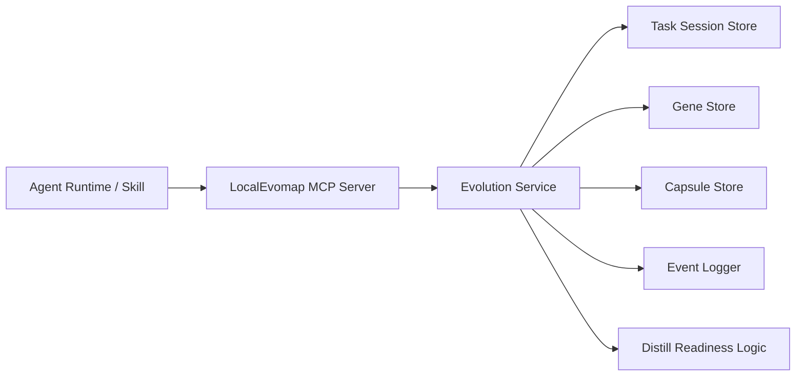

# Agent-Orchestrated MCP Evolution Design

## Goal

Redesign LocalEvomap so agent-facing evolution flows run through an MCP service instead of direct HTTP helpers, while keeping task completion judgment and retrospective generation inside the agent skill.

## Design Principles

- MCP is the only runtime integration surface for agents.
- The agent decides when a task is complete.
- LocalEvomap core remains the single source of truth for knowledge and evolution.
- Task-centered attribution replaces ad hoc feedback payloads.
- No backward compatibility is required for legacy agent HTTP helpers or CLI wrappers.

## Final Decision

Use a three-layer architecture:

1. **Agent Skill** for lifecycle orchestration and completion judgment.
2. **MCP Server** for standardized tools/resources and task session state.
3. **LocalEvomap Core** for event persistence, gene/capsule updates, and distillation readiness.

This keeps autonomy where the execution context exists, and keeps durable knowledge management where the system of record already lives.

## Responsibilities

### Agent Skill

The skill is responsible for:

- starting a task session
- deciding when enough work has been completed to finalize
- collecting self mistakes, user corrections, validation commands, and outcome
- explicitly recording which genes and capsules were actually used
- calling MCP tools in the correct order

The skill is not responsible for:

- direct store writes
- direct HTTP calls to LocalEvomap APIs
- distillation policy
- confidence and epigenetic scoring rules

### MCP Server

The MCP server is responsible for:

- exposing a stable tool surface for agents
- normalizing and validating input
- creating and updating task sessions
- attaching knowledge usage to task sessions
- translating task finalization into domain service calls
- exposing read-only resources for next-agent warm starts
- enforcing idempotency for task finalization

The MCP server is not responsible for:

- deciding whether a task is complete
- inventing retrospective content
- implementing storage-specific scoring logic inline

### LocalEvomap Core

The core is responsible for:

- persisting task sessions, events, genes, and capsules
- updating gene epigenetic marks from successful or failed reuse
- updating capsule confidence from verified reuse outcomes
- creating new capsules from reusable successful retrospectives
- evaluating whether distillation should run next

## System Architecture

## MCP Surface

### Tools

#### `start_task`

Creates a task session and returns first-pass knowledge recommendations.

**Input**

- `goal: string`
- `workspace: string`
- `client: 'codex' | 'cursor' | 'claude-code' | 'other'`
- `initialSignals?: string[]`
- `sessionMeta?: Record<string, unknown>`

**Output**

- `taskId: string`
- `recommendedGenes: Gene[]`
- `recommendedCapsules: Capsule[]`
- `workingHints: string[]`

#### `search_knowledge`

Returns matched genes and capsules for the current task or an ad hoc query.

**Input**

- `taskId?: string`
- `signals?: string[]`
- `query?: string`
- `workspace?: string`
- `limit?: number`

**Output**

- `genes: Gene[]`
- `capsules: Capsule[]`
- `whyMatched: string[]`

#### `record_usage`

Records which genes or capsules were actually used by the agent.

**Input**

- `taskId: string`
- `knowledge: Array<{ kind: 'gene' | 'capsule'; id: string; phase: 'plan' | 'implement' | 'validate'; note?: string }>`

**Output**

- `accepted: number`
- `taskState: 'active' | 'finalized'`

#### `get_task_context`

Returns accumulated task context for long-running work.

**Input**

- `taskId: string`

**Output**

- `task: TaskSession`
- `knowledgeUsed: KnowledgeUsageRef[]`
- `retrospectiveDraft: RetrospectiveDraft`

#### `finalize_task`

Closes the task and submits retrospective feedback into the evolution engine.

**Input**

- `taskId: string`
- `summary: string`
- `outcome: { status: 'success' | 'partial' | 'failed'; score: number }`
- `retrospective: { signals: string[]; selfMistakes: string[]; userCorrections: string[]; validations: Array<{ command: string; passed: boolean; notes?: string }> }`
- `createCapsule: boolean`

**Output**

- `eventId: string`
- `taskId: string`
- `genesUpdated: string[]`
- `capsulesUpdated: string[]`
- `distillReady: boolean`
- `recommendedNextAction?: 'none' | 'prepare-distill'`

### Resources

#### `evomap://workspace/<workspaceHash>/playbook`

Returns the most effective genes, capsules, and recurring mistakes for the current workspace.

#### `evomap://workspace/<workspaceHash>/recent-successes`

Returns recent successful capsules and summaries proven in the same workspace.

#### `evomap://task/<taskId>`

Returns the current task session, usage history, and draft retrospective state.

#### `evomap://distill/ready`

Returns the current distillation readiness summary for operators and diagnostics.

## Domain Model

### `TaskSession`

- `taskId: string`
- `goal: string`
- `workspace: string`
- `client: string`
- `status: 'active' | 'finalized'`
- `openedAt: string`
- `finalizedAt?: string`
- `signals: string[]`
- `knowledgeRefs: KnowledgeUsageRef[]`
- `retrospective?: TaskRetrospective`
- `outcome?: TaskOutcome`

### `KnowledgeUsageRef`

- `kind: 'gene' | 'capsule'`
- `id: string`
- `phase: 'plan' | 'implement' | 'validate'`
- `usedAt: string`
- `note?: string`

### `TaskRetrospective`

- `summary: string`
- `signals: string[]`
- `selfMistakes: string[]`
- `userCorrections: string[]`
- `validations: ValidationResult[]`

### `TaskOutcome`

- `status: 'success' | 'partial' | 'failed'`
- `score: number`

## Task Lifecycle

### 1. Task Start

The skill opens a task with `start_task`, receives a `taskId`, and immediately gets recommended genes and capsules.

### 2. Knowledge Attribution

Whenever the agent actually uses a recommendation, the skill calls `record_usage` instead of waiting until task end. This makes the final attribution explicit rather than inferred.

### 3. Task Completion Judgment

The skill decides the task is complete when:

- all active plan items are complete
- a concrete deliverable or conclusion exists
- no blockers remain
- validation is either complete or intentionally skipped with user acceptance

The MCP server does not make this decision.

### 4. Task Finalization

The skill calls `finalize_task` immediately before final delivery. The MCP server then:

1. validates the request
2. loads the task session
3. appends a `task.finalized` event
4. updates referenced genes and capsules using the task outcome
5. optionally creates a new capsule from the summary
6. recomputes distillation readiness
7. marks the task session as finalized

### 5. Next-Agent Warm Start

The next agent reads workspace resources, especially `playbook` and `recent-successes`, and begins with proven knowledge already filtered by workspace history.

## Distillation Policy

Distillation is not directly triggered by the skill. The skill only submits a high-quality finalized retrospective. The core decides readiness, and a later worker or operator can run distillation based on the returned readiness signal.

This keeps distillation policy centralized and prevents agent-specific behavior drift.

## Idempotency and Failure Handling

- `finalize_task` must be idempotent per `taskId`.
- Repeated `record_usage` calls with the same `(taskId, kind, id, phase)` tuple should collapse to a single usage record.
- If `record_usage` fails, the skill may retry or merge the data into the final retrospective.
- If `finalize_task` fails, the agent must still be able to deliver the user-facing result, but it should surface that knowledge write-back failed.

## Security Model

- Agent runtime uses local MCP transport and does not need direct bearer-token HTTP writes.
- Administrative HTTP endpoints remain optional for dashboard and ops use, not for the normal agent path.
- MCP tool inputs must be validated with strict schemas.
- Resources must expose only read-safe data.

## Repository Restructure

### Create

- `E:/projects/test_model/capability/mcp/server.ts`
- `E:/projects/test_model/capability/mcp/tools/start-task.ts`
- `E:/projects/test_model/capability/mcp/tools/search-knowledge.ts`
- `E:/projects/test_model/capability/mcp/tools/record-usage.ts`
- `E:/projects/test_model/capability/mcp/tools/get-task-context.ts`
- `E:/projects/test_model/capability/mcp/tools/finalize-task.ts`
- `E:/projects/test_model/capability/mcp/resources/workspace-playbook.ts`
- `E:/projects/test_model/capability/mcp/resources/recent-successes.ts`
- `E:/projects/test_model/capability/core/evolution-service.ts`
- `E:/projects/test_model/capability/core/task-session-manager.ts`
- `E:/projects/test_model/capability/storage/task-session-store.ts`
- `E:/projects/test_model/capability/agent-skill/SKILL.md`

### Modify

- `E:/projects/test_model/capability/index.ts`
- `E:/projects/test_model/capability/server.ts`
- `E:/projects/test_model/capability/README.md`
- `E:/projects/test_model/capability/docs/API_REFERENCE.md`
- `E:/projects/test_model/capability/docs/SKILL_INSTALL.md`
- `E:/projects/test_model/capability/package.json`

### Remove from the standard runtime path

- `E:/projects/test_model/capability/opencode/localevomap-skill/index.ts`
- `E:/projects/test_model/capability/localevolmap-skill.mjs`
- `E:/projects/test_model/capability/localevolmap-skill-cli.ts`

## Testing Strategy

### Unit Tests

- task session creation, mutation, and finalization
- usage de-duplication
- finalize outcome to gene/capsule update mapping
- capsule creation rules from successful retrospectives

### MCP Contract Tests

- input schema validation for every tool
- idempotent `finalize_task`
- resource payload shape and filtering

### Integration Tests

- `start_task -> record_usage -> finalize_task`
- multiple knowledge references in one task
- failed task finalization without capsule creation
- workspace resource warm-start behavior after finalized tasks

### Verification Commands

- `npm test -- storage/task-session-store.test.ts --runInBand --coverage=false`
- `npm test -- core/evolution-service.test.ts --runInBand --coverage=false`
- `npm test -- mcp/server.test.ts --runInBand --coverage=false`
- `npm test -- --runInBand --coverage=false`
- `npm run build`

## Explicit Non-Goals

- preserving old skill helper APIs
- supporting both agent HTTP and MCP paths indefinitely
- letting the MCP layer infer task completion from partial signals
- introducing self-modifying prompts or rules

## Summary

The clean split is:

- **skill decides when to evolve**
- **MCP standardizes how agents talk to evolution**
- **core decides what knowledge changes and when distillation is ready**

That gives agents autonomy without turning MCP into a fake planner or turning LocalEvomap core into a client-specific integration layer.
