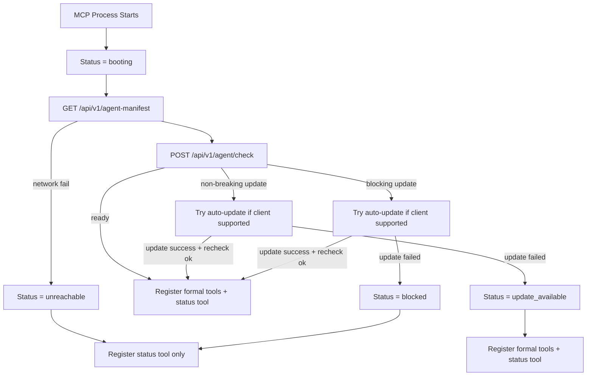

# Agent Bootstrap Versioning Design

## Goal

Add a server-authoritative version manifest and MCP bootstrap gate so LocalEvomap can decide whether agent-facing skill and MCP guidance are current before exposing formal tools.

## Problem

LocalEvomap currently relies on checked-in docs and skill files being manually refreshed by each client. That creates drift: one agent may use a newer MCP contract while another still runs stale skill guidance. When the service changes, there is no standard way for the MCP runtime to verify whether the local skill/runtime pair is still compatible.

The design must also satisfy a strict availability rule: if the LocalEvomap server is unreachable, the `local-evomap` MCP should still register successfully, but all formal LocalEvomap tools and resources must remain disabled. The only guaranteed surface in that state is a runtime-status capability that explains why the MCP is unavailable.

## Decision

Use a three-part bootstrap model:

1. **Server manifest authority**: the service exposes a single canonical manifest of MCP-runtime and client-skill versions.
2. **Bootstrap compatibility check**: the local MCP runtime compares its local versions and hashes against the server manifest before registering formal tools.
3. **Client-specific auto-update**: for supported clients (`codex`, `claude-code`, `cursor`), the MCP can automatically download and replace stale skill files, then re-check compatibility.

## High-Level Flow

## Server Responsibilities

The server becomes the source of truth for version policy.

It must expose:

- `GET /api/v1/agent-manifest`
- `POST /api/v1/agent/check`

It must track at least:

- `mcp.runtime`
- `skills.codex`
- `skills.claude-code`
- `skills.cursor`
- `skills.opencode`
- `skills.kimi`

Each manifest item should contain:

- `version`
- `hash`
- `breaking`
- `download_url`
- `auto_update_supported`

## MCP Responsibilities

The local MCP runtime becomes a bootstrap gate, not just a passive tool host.

It must:

- compute or load its local `mcp` and `skill` identity
- call the server manifest/check endpoints at startup
- decide whether to expose formal LocalEvomap tools
- always expose a status capability
- perform skill auto-update only for supported clients

## Runtime States

- `booting`
- `updating`
- `ready`
- `update_available`
- `blocked`
- `unreachable`
- `update_failed`

## Tool Exposure Policy

When state is `ready` or `update_available`:

- expose `start_task`
- expose `search_knowledge`
- expose `record_usage`
- expose `get_task_context`
- expose `finalize_task`
- expose workspace resources
- expose `get_runtime_status`

When state is `booting`, `updating`, `blocked`, or `unreachable`:

- expose `get_runtime_status` only

## Auto-Update Scope

Automatic skill download and replacement is enabled in the first phase only for:

- `codex`
- `claude-code`
- `cursor`

The first phase does not auto-update:

- `opencode`
- `kimi`

Those clients receive version diagnostics and download guidance, but no local file mutation.

## Failure Handling

### Server unreachable

- MCP startup still succeeds
- status becomes `unreachable`
- formal LocalEvomap tools/resources are not registered

### Non-breaking update available

- try auto-update for supported clients
- if update fails, continue in `update_available`
- formal tools remain available

### Breaking update available

- try auto-update for supported clients
- if update succeeds, re-check and proceed
- if update fails, move to `blocked`
- formal tools remain disabled until compatibility is restored

## Version Source of Truth

Keep a checked-in manifest source, for example:

- `E:/projects/test_model/capability/config/agent-manifest.json`

The manifest should store semantic versions and compatibility metadata. Runtime code can compute fresh hashes from the referenced files so that content drift is still detected when versions are not bumped.

## Documentation Impact

Docs must clearly state:

- LocalEvomap MCP now performs startup compatibility checks
- server unreachability disables all formal LocalEvomap MCP functions
- `get_runtime_status` is always available
- auto-update applies only to supported clients in phase 1

## Testing Strategy

Cover these scenarios:

1. manifest endpoint returns expected version authority
2. check endpoint returns `ready` for matching versions
3. check endpoint returns `update_available` for non-breaking drift
4. check endpoint returns `blocked` for breaking drift
5. MCP registers only status tool when server is unreachable
6. MCP auto-updates supported skills and rechecks successfully
7. MCP falls back to `update_available` or `blocked` when auto-update fails
