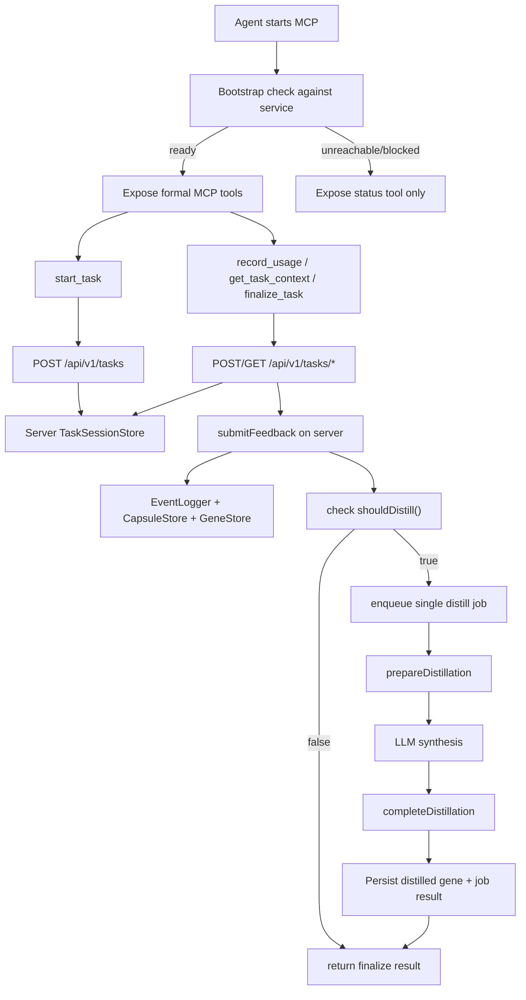

# Remote Evolution Closure Design

## Goal

Close the real LocalEvomap evolution loop so agent work creates authoritative server-side task sessions, feedback events, capsules, and distilled genes instead of only mutating local MCP data files.

## Problem

The current system has already connected the bootstrap/version-control plane, but the evolution data plane still lives in the local MCP runtime.

That creates three gaps:

1. agent MCP calls write task state, events, and capsules into local files instead of the deployed service
2. the deployed service can report `distill/status.ready = true`, but no production request path automatically executes `prepare -> synthesize -> complete`
3. dashboards and analytics read only server-side events, so they remain empty even when local MCP task finalization succeeds

As a result, LocalEvomap appears "working" from the agent perspective while the formal server never records a real evolution.

## Decision

Adopt a server-authoritative evolution flow with automatic, non-blocking distillation:

1. **Server-authoritative task APIs**: expose the task-session lifecycle over HTTP on the deployed service
2. **Remote-first MCP runtime**: make MCP tools call the server task APIs instead of local `TaskSessionStore` for authoritative work
3. **Automatic distill execution**: when a successful finalize produces a distill-ready state, the server schedules and executes distillation automatically
4. **Fail-safe degradation**: if the server is unreachable, LocalEvomap MCP disables formal capabilities; if distillation fails, finalize still succeeds and records the failure state separately

## Approaches Considered

### Option A — Remote-first MCP + automatic distill (recommended)

The MCP runtime keeps bootstrap/version checks and local status reporting, but all task lifecycle writes go to the service. The service becomes the single source of truth for tasks, usage refs, events, capsules, and distill jobs.

Pros:

- server dashboards finally reflect real agent work
- one authoritative event stream for analytics and future learning
- simplest mental model for operators and users

Cons:

- requires new HTTP task endpoints
- increases service-side responsibility for orchestration and idempotency

### Option B — Local-first MCP with background sync

Keep current local task store and periodically sync local tasks/events to the server.

Pros:

- smaller immediate MCP refactor

Cons:

- introduces dual-write/sync conflict risk
- preserves ambiguous source of truth
- makes debugging and correctness much harder

### Option C — Server auto-distill only

Leave task/session writes local and only automate server distillation.

Pros:

- smallest server change

Cons:

- does not solve missing authoritative events
- dashboards still remain misleading

## High-Level Architecture

## Server Responsibilities

The server must expose task lifecycle APIs that mirror MCP semantics:

- `POST /api/v1/tasks`
- `POST /api/v1/tasks/:taskId/search`
- `POST /api/v1/tasks/:taskId/usage`
- `GET /api/v1/tasks/:taskId`
- `POST /api/v1/tasks/:taskId/finalize`
- `GET /api/v1/distill/jobs`
- `GET /api/v1/distill/jobs/:jobId`

The server already owns `submitFeedback()`, event storage, and distillation primitives. This design keeps those behaviors server-side and makes them reachable through the task finalization flow.

## MCP Responsibilities

The MCP runtime keeps local bootstrap, compatibility, and auto-update behavior, but its formal tools become thin clients over the server APIs.

It must:

- call remote task endpoints for all authoritative work
- preserve tool names and response shapes already shipped to agents
- expose `get_runtime_status` even when the server is unreachable
- disable formal tools/resources completely when the server is unavailable or blocked

The local filesystem-backed `LocalEvomap` instance remains useful only for tests, local development, and explicit offline scenarios — not as the production authority for MCP task traffic.

## Automatic Distillation Design

Automatic distillation runs after successful finalization and is explicitly non-blocking.

### Trigger rules

After `finalize_task` completes `submitFeedback()`:

- call `shouldDistill()` on the authoritative server data
- if `false`, return immediately
- if `true`, create or reuse a single in-flight distill job

### Execution rules

- allow only one active distill job at a time
- persist job state as `pending | running | succeeded | failed | skipped`
- persist failure reasons for later inspection
- if LLM configuration is missing or request fails, mark the job failed but keep task finalization successful
- if a process restart happens mid-job, the next trigger can retry from persisted state rather than duplicating distilled genes

### Idempotency

The distill pipeline must avoid duplicate output by:

- deduplicating jobs with a stable fingerprint of source capsule ids and distillation window
- rejecting creation of a second running job
- validating that `completeDistillation()` does not write the same distilled gene twice

## Error Handling

### Server unreachable

- MCP startup succeeds only in status-only mode
- no formal LocalEvomap tools are exposed
- no local fallback task writes occur in production mode

### Remote task API failure during a tool call

- tool returns a structured error
- task is not partially finalized client-side
- runtime status records recent remote failure details

### Distillation failure

- `finalize_task` still succeeds if feedback/event persistence succeeded
- result includes distill scheduling metadata when available
- operators can inspect failure using distill job endpoints

## Data Model Changes

Add a persistent distill-job record containing at least:

- `jobId`
- `status`
- `createdAt`
- `startedAt`
- `finishedAt`
- `sourceCapsuleIds`
- `promptFilePath` or summary payload
- `resultGeneId`
- `error`

Task finalization responses should include:

- existing fields (`eventId`, `capsuleId`, `distillReady`)
- optional `distillJobId`
- optional `distillStatus`

## Compatibility Constraints

This design must preserve:

- existing MCP tool names
- existing `start_task` and `get_task_context` response shapes
- current bootstrap/versioning behavior
- current unsupported-client behavior for skill auto-update

## Testing Strategy

Cover the following:

1. MCP tools use remote task APIs rather than local task storage
2. remote finalize writes an event that appears in server `/api/v1/events`
3. successful finalize can schedule a distill job automatically
4. distill job failures do not fail task finalization
5. server-unreachable bootstrap still exposes status-only MCP
6. duplicate finalize/distill triggers remain idempotent
7. distill job endpoints report accurate state transitions

## Documentation Impact

Docs must explain that:

- the production LocalEvomap authority is the deployed service, not local MCP files
- MCP formal tools require the remote service to be reachable
- task finalization now records authoritative server events
- distillation can run automatically after finalize
- distill failures are observable and non-blocking
